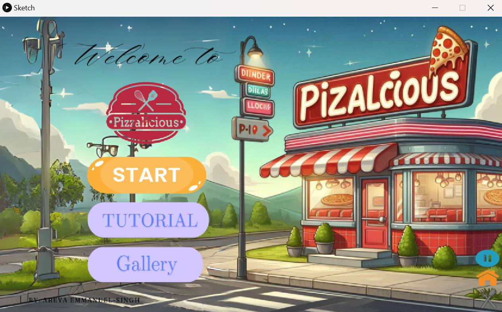
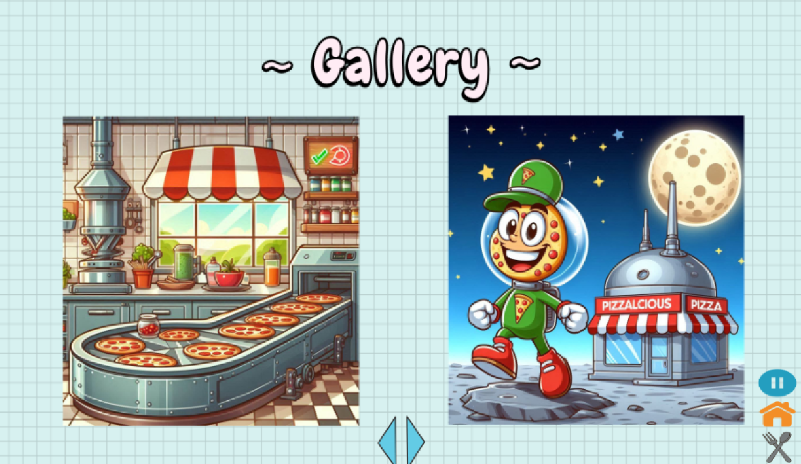
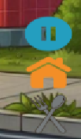

# Pizzalicious

## Objective 

When playing the Pizzalicious game, the goal is to take the order of the customer and collect them in the order requested. Players need to gather all ingredients before the timer runs out in order to win the game. If they come into contact with the wrong ingredient, they will lose a life. As the levels increase, so does the difficulty. 

## Gameplay Mechanics

`GamePlay/Gallery/Tutorial:` Upon entering the game, players are to select whether they want to play the game, view the tutorial, or visit the gallery

`Taking the order:` Players are to select their desired level of difficulty and then drag the ingredients asked for onto the recipe pad by clicking on the ingredient and dragging it to its spot before entering the kitchen by pressing on the ‘k’ key

`Collecting Ingredients:` Players must move a pizza crust left and right (using the LEFT and RIGHT arrow keys) to collect the ingredients. If the ingredient lands on the pizza they are one step closer to winning the game.

`Lives:` No matter the level, the player will start with 5 hearts. A will be lost when the wrong ingredient is collected.

`Timer:` Once a level is selected, a timer will automatically be shown at the top left of the screen. It is a countdown timer, and in order to win the game, all of the game objectives must be completed before the timer runs out.

`Collision Detection:` Players must avoid obstacles (ie. the wrong ingredient) and select/drag the right items or else lives could be lost

`Navigation bar:` On the bottom left of the screen there is a navigational bar that allows the player to return to the home, go to the take order screen, and pause the game for 5 seconds)

`Navigation:` To move through each tutorial page, use the UP key.
              To move through the gallery either press the left and     right keys or click on the arrorws displayed on the screen
              To get to the kitchen press the 'k' key

`Limitations:` No music accompanies the game

### Home Page

### Gallery

### Navigation Bar
 